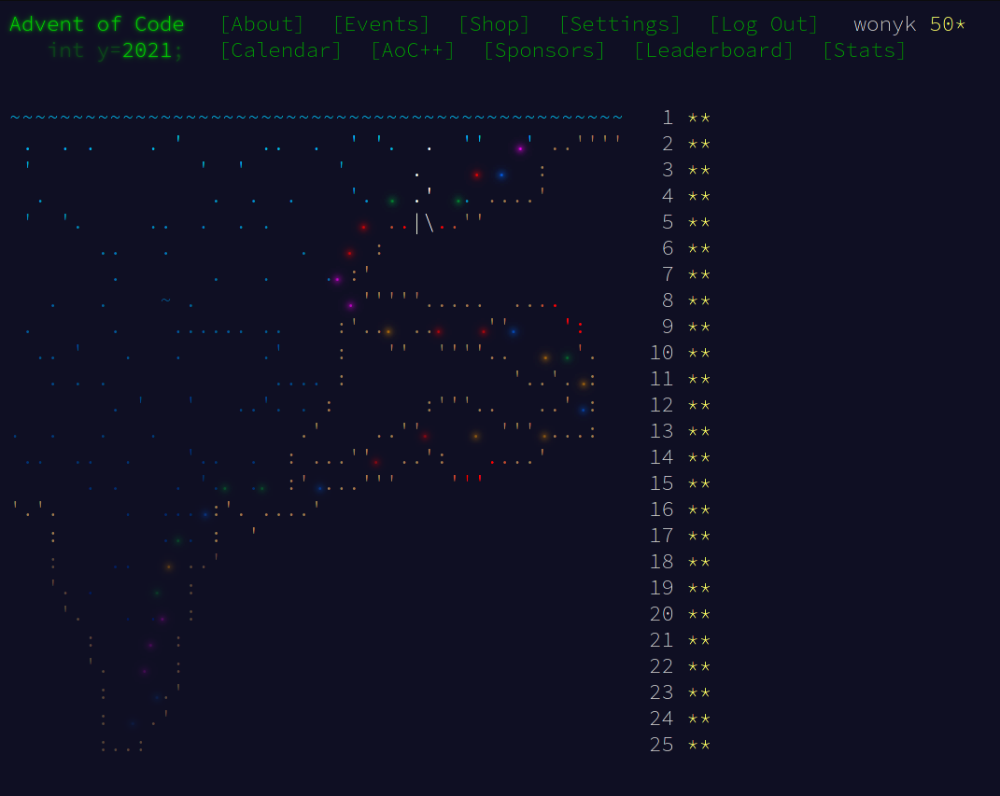

# AOC2021

A repo containing my solutions for Advent of Code 2021!

## About

[Advent of Code 2021](https://adventofcode.com) is a series of small programming puzzles for a variety of skillsets.

This is my first time attempting in this event and I hope to learn much from the great community of talented coders.

I feel proud to have completed AOC 2021. While many problems are certainly difficult, I am grateful for the wonderful
subreddit which has helped and guided me to tackle and solve those challenges.

I would certainly take part again next year!
